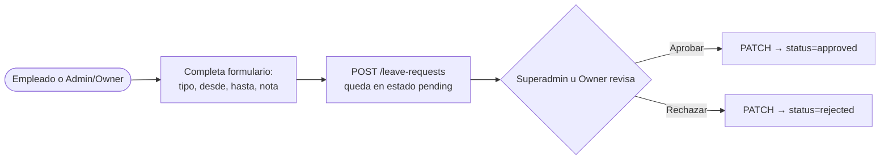

# Manual — Recursos Humanos (RRHH)

> **Última actualización:** 2026-09-03 — MrCasuela
> (actualizar esta línea cada vez que se edite el documento)

> **A quién sirve:** módulo por local, ruta `/local/:localId/rrhh`. Accesible para Superadmin, Owner, Admin de local y también para workers (Empleado/Cajero) — pero **lo que cada rol puede hacer varía mucho** (ver más abajo, es la parte más importante de este manual).
>
> Backend: **Gestflow-Backend-V2**. Endpoints en `app/api/routes/employees.py`, `shifts.py`, `leave_requests.py`.

---

## Quién puede hacer qué (importante, léase antes de seguir)

El módulo tiene 3 pestañas: **Empleados**, **Turnos**, **Permisos**. Pero no todos los roles ven las 3:

- **Superadmin y Owner** (dueño de franquicia): ven las 3 pestañas completas, pueden crear fichas de empleado, programar turnos, y aprobar/rechazar solicitudes de permiso de cualquiera.
- **Admin de local y workers (Empleado/Cajero):** solo ven la pestaña **Permisos**, y solo pueden **solicitar su propio permiso** — no ven el formulario de crear ficha ni el de programar turno, ni el botón de aprobar/rechazar.

Esto es una decisión del código (`canManageHr = Superadmin o Owner`, `src/components/hr/HrModule.jsx:41`), no un bug — un Admin de local, aunque administra su local en otras pantallas, no gestiona RRHH desde acá.

---

## 1. Empleados

**Qué es:** las fichas de RRHH del local — datos como RUT, cargo, fecha de ingreso, frecuencia de pago y sueldo base. Una ficha se vincula a una cuenta de usuario existente (`user_id`), no la reemplaza.

**Cómo se usa (Superadmin/Owner):**
1. Completá el formulario "Nueva ficha de empleado": elegí el usuario a vincular (desplegable con email + rol), RUT, nombre completo, cargo, fecha de ingreso, frecuencia de pago (mensual/quincenal/etc.) y sueldo base en CLP.
2. Hacé click en "Crear ficha".
3. Más abajo, la tabla lista todas las fichas del local con su estado.

**Ficha técnica:** hook `useEmployees` (`src/hooks/useEmployees.js`). Endpoints: `GET /employees` (o `/employees/me` para el propio), `POST /employees`, `PATCH /employees/{id}`. Datos: `user_id`, `rut`, `full_name`, `cargo`, `fecha_ingreso`, `pay_frequency`, `base_salary`, `primary_local_id`.

---

## 2. Turnos

**Qué es:** la programación de turnos de trabajo por empleado.

**Cómo se usa (Superadmin/Owner):**
1. En "Programar turno", elegí el empleado (debe tener ficha creada primero), la fecha/hora de inicio y de fin.
2. Hacé click en "Crear turno".
3. La lista de abajo muestra todos los turnos del local con su estado.

**Ficha técnica:** hook `useShifts` (`src/hooks/useShifts.js`). Endpoints: `GET /shifts?local_id=`, `POST /shifts`, `PATCH /shifts/{id}`. Datos: `employee_id`, `local_id`, `scheduled_start`, `scheduled_end`.

---

## 3. Permisos

**Qué es:** solicitudes de licencia/ausencia (vacaciones, licencia médica, etc.) y su aprobación. Es la única pestaña visible para Admin de local y workers.

**Cómo se usa:**
- **Cualquier rol** (incluido Admin de local y workers): completá el formulario — tipo de permiso, fecha desde/hasta, nota opcional — y hacé click en "Enviar solicitud". Un worker o Admin solo puede solicitar para sí mismo (no aparece el selector de empleado).
- **Superadmin/Owner:** además puede elegir a nombre de qué empleado solicita (o dejarlo en blanco para su propia ficha), y sobre cada solicitud con estado "Pendiente" tiene los botones **Aprobar** / **Rechazar**.
- La lista de "Solicitudes" muestra todas las que existen, con su tipo, rango de fechas, nota y estado (pendiente/aprobado/rechazado).

**Ficha técnica:** hook `useLeaveRequests` (`src/hooks/useLeaveRequests.js`). Endpoints: `GET /leave-requests`, `POST /leave-requests` (crear), `PATCH /leave-requests/{id}` (decidir — `decideRequest`). Datos: `employee_id` (opcional para Superadmin/Owner, se omite para autosolicitud), `type`, `date_from`, `date_to`, `note`, `status` (`pending`/`approved`/`rejected`).

---

## Errores comunes

| Situación | Qué ves | Qué hacer |
|---|---|---|
| Crear ficha sin elegir usuario/completar campos obligatorios | El formulario no envía (campos marcados `required`) | Completá todos los campos marcados |
| Programar turno sin empleados creados | El botón "Crear turno" queda deshabilitado | Primero creá al menos una ficha de empleado |
| Error de red/backend al crear/aprobar/rechazar | Recuadro rojo con el mensaje de error debajo del formulario | Reintentar |
| Admin de local o worker no ve pestañas de Empleados/Turnos | No es un error — ese rol solo tiene acceso a Permisos (ver sección "Quién puede hacer qué") | — |

---

## Referencias de archivo

- `src/components/hr/HrModule.jsx` — módulo completo, las 3 pestañas.
- `src/hooks/useEmployees.js`, `useShifts.js`, `useLeaveRequests.js`.
- `src/lib/hrApi.js` — capa de API (endpoints, formateo de estados).
- Backend (`Gestflow-Backend-V2`): `app/api/routes/employees.py`, `shifts.py`, `leave_requests.py`, `payroll.py` (no cubierto en este manual — no tiene pantalla propia en el frontend aún).
