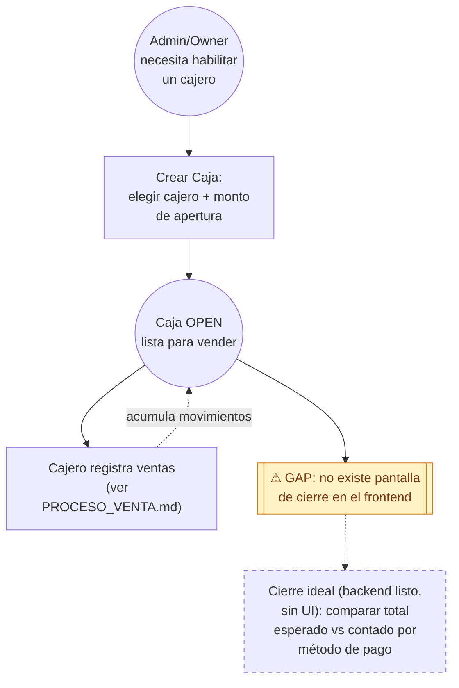

# Proceso — Apertura y Cierre de Caja

> **Última actualización:** 2026-09-03 — MrCasuela
> (actualizar esta línea cada vez que se edite el documento)

> **⚠️ Nota de alcance — leer antes de seguir:** este documento cubre un proceso **incompleto en la UI a propósito documentado así**. La **apertura** de caja está implementada de punta a punta. El **cierre y arqueo** está completamente construido en Backend V2 (endpoint, cálculo de total esperado por método de pago) pero **no existe ningún botón ni pantalla en el frontend para cerrarla** — verificado: no hay ninguna referencia a "cerrar caja" en todo el código de `Gestflow-Frontend`. Este documento existe precisamente para dejar esa brecha registrada (§6), no porque el proceso esté terminado.

---

## 1. Descripción del proceso

### 1.1 Objetivo

Abrir una caja para que un local pueda operar el POS (toda venta requiere una caja abierta — ver precondición en [`PROCESO_VENTA.md`](PROCESO_VENTA.md) §1.3) y, en teoría, cerrarla al final del turno con un arqueo que compare lo esperado contra lo contado.

### 1.2 Actores

| Actor | Rol |
|---|---|
| **Admin / Owner** | Crea la caja y asigna qué cajero la opera. Un rol `Empleado` puro no puede crear una caja directamente (ver §4). |
| **Cajero (empleado asignado)** | Opera la caja ya abierta desde el POS — no la abre ni la cierra él mismo. |
| **Backend V2** | Valida transiciones de estado y calcula el resumen/arqueo. |

### 1.3 Precondiciones

- El local existe y tiene al menos un cajero (`cashier_user_id`) al que asignar la caja.
- Quien crea la caja tiene rol Admin/Owner/Superadmin (no `Empleado`).

### 1.4 Resultado esperado (apertura)

Una caja en estado `OPEN`, con `monto_apertura` (efectivo inicial) y `cashier_user_id` asignados, lista para que ese cajero registre ventas.

### 1.5 Alcance y fuera de alcance

Dentro: creación de caja (apertura) tal como existe hoy, y la lógica de cierre/arqueo tal como está construida en el backend (aunque sin UI). Fuera: conciliación contable posterior, vinculación con MercadoPago (ver [`PROCESO_CAJA_MP_PAIRING.md`](PROCESO_CAJA_MP_PAIRING.md)).

---

## 2. Diagrama BPMN (Mermaid)

---

## 3. Detalle de actividades

### 3.1 Apertura (implementada)

| Actividad | Qué hace el usuario/sistema | Componente técnico | API / Evento | Datos principales |
|---|---|---|---|---|
| Crear Caja | El admin abre el modal "Nueva Caja" desde la pestaña Caja Virtual del módulo Administrativo, elige el cajero y el monto de apertura | `NuevaCajaModal` (`AdministrativeModule.jsx`) | `POST /cajas` | `local_id`, `cashier_user_id`, `monto_apertura` |
| Operar la caja | El cajero asignado usa el POS normalmente — cada venta completada suma un movimiento de ingreso a esta caja | ver `PROCESO_VENTA.md` | `PATCH /orders/{id}` (efecto colateral) | `movimientos_caja` |

### 3.2 Cierre (backend listo, sin UI — ver §6)

| Actividad | Qué haría el usuario/sistema | Componente técnico | API / Evento | Datos principales |
|---|---|---|---|---|
| Cerrar caja | *(no existe botón)* — el backend acepta `PATCH /cajas/{id}` con `status=closed` | `CajaService.update` (`app/services/cajas.py`) | `PATCH /cajas/{id}` | `status=CLOSED`, `closed_at` |
| Ver resumen/arqueo | *(no existe pantalla)* — el backend calcula el total esperado vs. ingresado, desglosado por método de pago | `CajaService.get_resumen` | `GET /cajas/{id}/resumen` | `monto_apertura`, `total_ingresos`, `total_esperado`, `por_metodo` |

---

## 4. Errores y excepciones

| Error | Causa | Qué ve el usuario | Cómo responde el sistema |
|---|---|---|---|
| Empleado intenta crear una caja | Rol `Empleado` no tiene permiso para abrir cajas | Error de permiso | 403 — solo Admin/Owner/Superadmin pueden crear |
| Admin de otro local/negocio | Intenta crear una caja para un local que no es el suyo | Error de permiso | 403 |
| Cajero inexistente | El `cashier_user_id` no existe | Error al crear | 404 |
| Cerrar una caja ya cerrada | (solo alcanzable vía API directa, no hay UI) | — | 400 "La caja ya está cerrada" |
| Reabrir una caja cerrada | (solo alcanzable vía API directa) | — | 400 "No se puede reabrir una caja cerrada" |

---

## 5. Trazabilidad: Actividad BPMN → Componente técnico → API/Evento → Datos

| Actividad BPMN | Componente técnico | API / Evento | Datos involucrados |
|---|---|---|---|
| Crear Caja (apertura) | `NuevaCajaModal` → `createCajaV2` | `POST /cajas` | `local_id`, `cashier_user_id`, `monto_apertura` |
| Operar caja (ventas) | flujo de venta completo | `PATCH /orders/{id}` | `movimientos_caja` |
| Cerrar caja (no expuesto en UI) | `CajaService.update` | `PATCH /cajas/{id}` `status=closed` | `status`, `closed_at` |
| Resumen/arqueo (no expuesto en UI) | `CajaService.get_resumen` | `GET /cajas/{id}/resumen` | `total_ingresos`, `total_esperado`, `por_metodo` |

---

## 6. Brechas funcionales conocidas

- [ ] **6.1 — No existe forma de cerrar una caja desde la aplicación.** El backend soporta la transición `OPEN → CLOSED` (`PATCH /cajas/{id}`) y un endpoint de resumen/arqueo completo (`GET /cajas/{id}/resumen`, con `total_esperado` vs `total_ingresos` desglosado por método de pago) — pero el frontend nunca llama a ninguno de los dos. No hay botón "Cerrar caja" en ninguna pantalla. **Implicación práctica:** las cajas quedan abiertas indefinidamente; no hay proceso de arqueo de turno en el producto actual. Esta es la brecha más importante de todo este documento — priorizarla si se retoma este flujo.
- [ ] **6.2 — Un cajero no puede autoabrirse una caja.** Solo Admin/Owner/Superadmin pueden crear una caja (`_require_open_access` bloquea `EMPLEADO`); el cajero solo opera una caja que alguien más le asignó. Documentado acá porque no es obvio mirando la pantalla del POS — vale la pena confirmarlo con el equipo si es el comportamiento deseado.

---

## 7. Referencias de archivo

- `src/components/administrative/*` (modal "Nueva Caja", pestaña Caja Virtual dentro de `AdministrativeModule.jsx`).
- `src/lib/administrativeApi.js` (`createCaja` → `createCajaV2`), `src/lib/salesApi.js` (`createCajaV2`, `listCajas`, `getActiveCaja`), `src/hooks/useCajaActiva.js`.
- Backend (`Gestflow-Backend-V2`): `app/api/routes/cajas.py`, `app/services/cajas.py`, `app/schemas/sales.py` (`CajaCreate`, `CajaUpdate`, `CajaResumenOut`).
