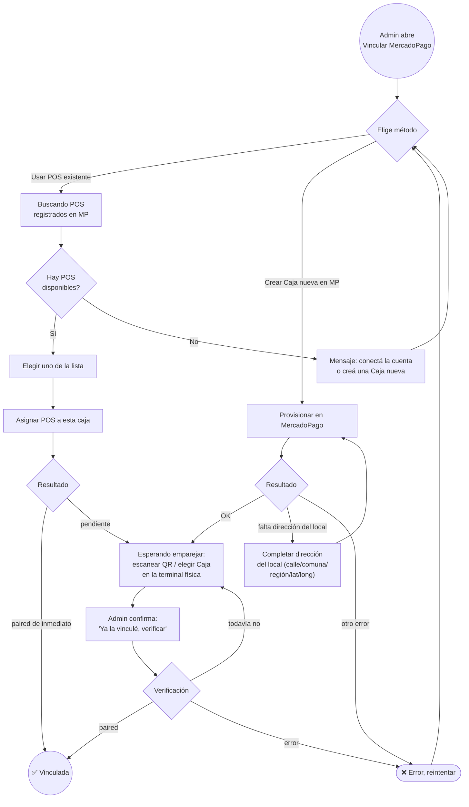

# Proceso — Vinculación de Caja con MercadoPago

> **Última actualización:** 2026-09-03 — MrCasuela
> (actualizar esta línea cada vez que se edite el documento)

> **Nota de alcance:** proceso vivo hoy contra **Gestflow-Backend-V2** (a diferencia de otros documentos en esta carpeta, no hay ambigüedad de backend acá). Complementa a [`PROCESO_VENTA.md`](PROCESO_VENTA.md) — este documento cubre cómo una caja llega a poder cobrar con MercadoPago Point; una vez vinculada, el cobro en sí sigue el subproceso de pago de ese documento (§2.3).

---

## 1. Descripción del proceso

### 1.1 Objetivo

Vincular una caja de un local con un dispositivo/cuenta de MercadoPago (POS físico Point Smart), para que esa caja pueda cobrar con tarjeta.

### 1.2 Actores

| Actor | Rol |
|---|---|
| **Admin / Owner** | Persona que administra el local, ejecuta la vinculación desde el módulo Administrativo. |
| **Sistema Web** | `Gestflow-Frontend` — modal de vinculación. |
| **Backend V2** | Orquesta la conversación con la API de MercadoPago. |
| **MercadoPago** | Plataforma externa — dueña de las Cajas/POS registrados en la cuenta del negocio. |

### 1.3 Precondiciones

- La caja ya existe (fue creada — ver [`PROCESO_CAJA_APERTURA_CIERRE.md`](PROCESO_CAJA_APERTURA_CIERRE.md)).
- El negocio tiene una cuenta de MercadoPago conectada (OAuth) — sin eso, "Crear Caja nueva en MercadoPago" y "usar POS existente" fallan.

### 1.4 Resultado esperado

La caja queda con `pairing_status = paired` y un `terminal_id` asociado — a partir de ahí, el cobro con MercadoPago Point en esa caja funciona (`PROCESO_VENTA.md` §2.3).

### 1.5 Alcance y fuera de alcance

Dentro: los 3 caminos de vinculación (crear caja nueva en MP, usar POS existente, resolver falta de dirección). Fuera: conexión OAuth inicial de la cuenta MercadoPago del negocio (proceso previo, no cubierto acá), cobro en sí (cubierto en `PROCESO_VENTA.md`).

---

## 2. Diagrama BPMN (Mermaid)

Máquina de estados literal del componente (comentario en el código, `CajaMpPairingModal.jsx:10-11`): `choose_method → loading_available → choose_existing → provisioning → needs_location → awaiting_pairing → verifying → paired → error`.

---

## 3. Detalle de actividades

| Actividad | Qué hace el usuario/sistema | Componente técnico | API / Evento | Datos principales |
|---|---|---|---|---|
| Elegir método | El admin decide entre "usar POS existente" o "crear Caja nueva" | `CajaMpPairingModal.jsx` (`choose_method`) | — | — |
| Buscar POS disponibles | Lista los POS de la cuenta MP del negocio sin asignar todavía | `handleShowExisting` | `GET /locals/{localId}/mp/available-pos` | lista de POS (id, nombre) |
| Asignar POS existente | Vincula un POS ya existente en MP a esta caja | `handleSelectExisting` | `POST /cajas/{cajaId}/mp/assign-existing` | `mercadopago_pos_id` |
| Provisionar Caja nueva | Crea una Caja nueva del lado de MercadoPago para este local/caja | `handleProvision` | `POST /cajas/{cajaId}/mp/provision` | — |
| Completar dirección del local | Si MP rechaza el provisioning por falta de dirección, se pide completarla | `handleSaveLocation` | `PUT /locals/{localId}/mp-location` | `street_name`, `city_name`, `state_name`, `latitude`, `longitude` |
| Esperar emparejamiento | El operador escanea el QR / selecciona la Caja directamente en la terminal física Point | pantalla de instrucciones (`awaiting_pairing`) | — | — |
| Verificar emparejamiento | El admin confirma manualmente que ya emparejó, y el sistema chequea contra MP | `handleVerify` | `POST /cajas/{cajaId}/mp/verify-pairing` | `pairing_status`, `terminal_id` |

---

## 4. Errores y excepciones

| Error | Causa | Qué ve el usuario | Cómo responde el sistema |
|---|---|---|---|
| Falta dirección del local | MercadoPago rechaza el provisioning porque el local no tiene dirección cargada | Formulario de dirección | Pide completar y reintenta el provisioning automáticamente al guardar |
| Sin POS disponibles | La cuenta MP no tiene POS sin asignar | "No encontramos POS sin asignar... conectá la cuenta o creá una Caja nueva" | Sugiere el otro camino |
| Verificación sin éxito | El operador todavía no eligió esta Caja en la terminal física | "Todavía no detectamos la terminal. Verificá que hayas elegido esta Caja en la terminal y volvé a intentar." | Se queda en `awaiting_pairing`, permite reintentar verificar |
| Error genérico de API (provisioning, asignación, verificación) | Fallo de red o de MercadoPago | Mensaje de error + botón "Reintentar" | Vuelve a `choose_method` |

---

## 5. Trazabilidad: Actividad BPMN → Componente técnico → API/Evento → Datos

| Actividad BPMN | Componente técnico | API / Evento | Datos involucrados |
|---|---|---|---|
| Buscar POS disponibles | `handleShowExisting` | `GET /locals/{id}/mp/available-pos` | lista de POS MP |
| Asignar POS existente | `handleSelectExisting` | `POST /cajas/{id}/mp/assign-existing` | `mercadopago_pos_id` |
| Provisionar Caja nueva | `handleProvision` | `POST /cajas/{id}/mp/provision` | — |
| Completar dirección | `handleSaveLocation` | `PUT /locals/{id}/mp-location` | dirección + coordenadas |
| Verificar emparejamiento | `handleVerify` | `POST /cajas/{id}/mp/verify-pairing` | `pairing_status`, `terminal_id` |

---

## 6. Brechas funcionales conocidas

- [ ] **6.1 — Detección de "falta dirección" por coincidencia de texto.** `handleProvision` (`CajaMpPairingModal.jsx:29-38`) decide si mostrar el formulario de dirección buscando la palabra `"direccion"` (sin tilde) dentro del mensaje de error que devuelve el backend, en vez de un código de error estructurado. **Implicación:** si el backend cambia la redacción del mensaje, este camino se rompe silenciosamente y el usuario ve un error genérico en lugar del formulario de dirección.

---

## 7. Referencias de archivo

- `src/components/pos/CajaMpPairingModal.jsx` — modal completo, máquina de estados.
- `src/lib/administrativeApi.js` — `provisionCajaMp`, `verifyCajaMpPairing`, `putLocalMpLocation`, `getAvailableMpPos`, `assignExistingMpPos`.
- Backend (`Gestflow-Backend-V2`): rutas `/cajas/{id}/mp/*`, `/locals/{id}/mp/*`, `/locals/{id}/mp-location`.
