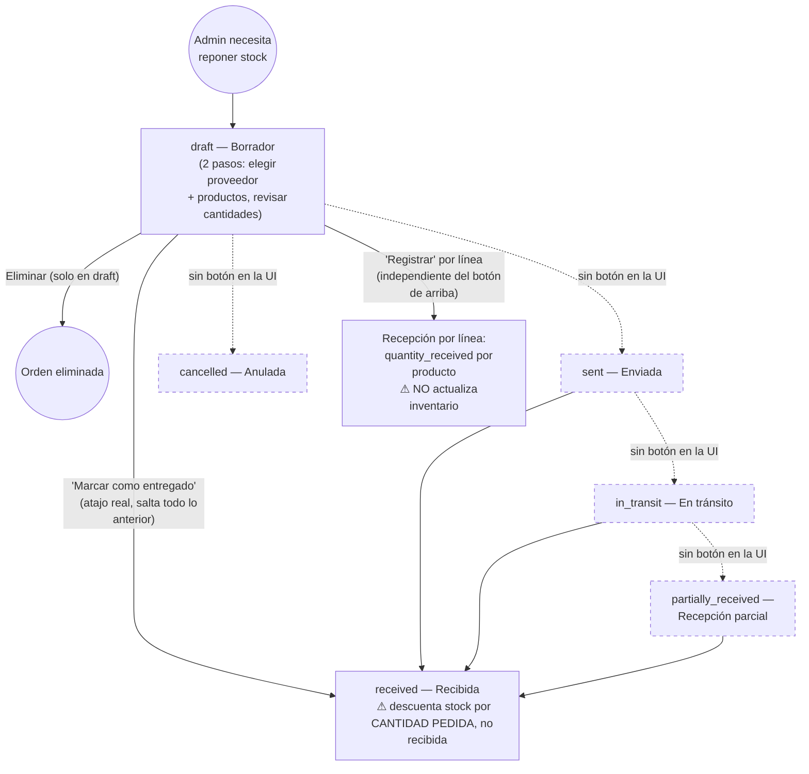

# Proceso — Compras Semanales

> **Última actualización:** 2026-09-03 — MrCasuela
> (actualizar esta línea cada vez que se edite el documento)

> **⚠️ Nota de alcance — leer antes de seguir:** este proceso se implementó contra el backend **legacy `Gestflow-backend`** (`/weekly-purchase-orders*`). **Ese endpoint no existe en Backend V2** — se verificó que no hay ningún archivo de rutas equivalente en `Gestflow-Backend-V2/app/api/routes/`. El frontend llama siempre al único backend configurado (`VITE_API_URL`, hoy Backend V2) y **no tiene ningún mecanismo de fallback ni feature flag** para esta pantalla — a diferencia de Rendiciones (`PROCESO_RENDICIONES.md`), que sí está apagada a propósito. **Resultado: hoy, contra el backend en uso, esta pantalla está rota — cualquier acción falla con error de red/404.** Se documenta igual, tal como existe en el código, para que quede registrado qué hace y qué falta para portarlo a V2.

---

## 1. Descripción del proceso

### 1.1 Objetivo

Generar y administrar órdenes de compra semanales a proveedores: armar un pedido, enviarlo, y registrar la recepción de mercadería para actualizar el inventario.

### 1.2 Actores

| Actor | Rol |
|---|---|
| **Admin / Owner** | Único actor dentro de la app — arma, envía y recibe la orden. Ruta gateada a rol `ADMIN_AND_ABOVE`. |
| **Proveedor** | Actor externo — recibe el pedido fuera del sistema (no hay pantalla de proveedor). |

### 1.3 Precondiciones

- Backend legacy operativo y accesible (hoy no es el caso — ver nota de alcance).
- Proveedor y sus productos ya registrados en el sistema.

### 1.4 Resultado esperado

Una orden en estado `received`, con el inventario del local actualizado según lo comprado.

### 1.5 Alcance y fuera de alcance

Dentro: el ciclo de vida de una orden de compra tal como está en el código (ideal y real). Fuera: facturación/DTE del proveedor, pagos a proveedores.

---

## 2. Diagrama BPMN (Mermaid)

Hay dos versiones que vale la pena distinguir: el **modelo de 6 estados** que existe como enum (`ALLOWED_STATUSES`), y lo que la **UI realmente permite alcanzar** hoy (marcado en el diagrama).

**Cómo leer el diagrama:** las líneas punteadas y los estados marcan lo que existe en el enum del backend pero **no tiene ningún control en la interfaz** — la variable `statusEdit`/`applyStatus` que debería exponer un selector de estado está definida en `WeeklyPurchaseDetailPage.jsx` pero nunca se renderiza (código muerto). En la práctica, desde la UI solo se llega a `draft`, `received` (por el atajo) o eliminado.

---

## 3. Detalle de actividades

| Actividad | Qué hace el usuario/sistema | Componente técnico | API / Evento | Datos principales |
|---|---|---|---|---|
| Crear borrador | El admin elige proveedor y productos (paso 1), revisa cantidades (paso 2) y confirma | `NewWeeklyOrderModal` (`WeeklyPurchasesPage.jsx`) | `POST /weekly-purchase-orders` | `supplier_id`, líneas (`product_id`, `quantity_ordered`, `unit_price_clp`) |
| Editar líneas | Mientras está en `draft`, se pueden reemplazar los productos/cantidades | — | `PUT /weekly-purchase-orders/{id}/items` | mismas líneas — bloqueado si el estado no es `draft` |
| Eliminar borrador | Solo disponible si el estado es `draft` | `WeeklyPurchaseDetailPage.jsx` | `DELETE /weekly-purchase-orders/{id}` | — |
| Marcar como entregado | Atajo que fuerza el estado a `received` directamente, sin pasar por los estados intermedios | `markAsDelivered` | `PATCH /weekly-purchase-orders/{id}` `status=received` | descuenta stock por `quantity_ordered` de cada línea (ver bug §6) |
| Registrar recepción por línea | Anota cuánto se recibió realmente de un producto puntual | `registerReception` | `PATCH .../items/{itemId}/reception` | `quantity_received` — bloqueado si el estado es `draft` |

---

## 4. Errores y excepciones

| Error | Causa | Qué ve el usuario | Cómo responde el sistema |
|---|---|---|---|
| Recepción en borrador | Se intenta registrar recepción de una línea mientras la orden sigue en `draft` | Mensaje de error | 400 "Recepción no aplica en borrador" |
| Editar líneas fuera de borrador | Se intenta reemplazar productos de una orden que ya no está en `draft` | Mensaje de error | 400 "Solo se pueden editar líneas en borrador" |
| Producto ajeno al proveedor | Se intenta agregar un producto que no pertenece al proveedor elegido | Mensaje de error al guardar | Rechaza la línea |
| Cantidad inválida | `quantity_ordered` ≤ 0 | Mensaje de error | Rechaza la línea |
| **Cualquier acción hoy** | Backend legacy no está detrás de `VITE_API_URL` (Backend V2 no tiene esta ruta) | Error de red / 404 genérico | La pantalla no completa ninguna operación — ver nota de alcance |

---

## 5. Trazabilidad: Actividad BPMN → Componente técnico → API/Evento → Datos

| Actividad BPMN | Componente técnico | API / Evento | Datos involucrados |
|---|---|---|---|
| Crear borrador | `NewWeeklyOrderModal` | `POST /weekly-purchase-orders` | proveedor, líneas |
| Editar líneas (solo draft) | `WeeklyPurchaseDetailPage.jsx` | `PUT .../items` | líneas |
| Eliminar borrador | `WeeklyPurchaseDetailPage.jsx` | `DELETE /weekly-purchase-orders/{id}` | — |
| Marcar como entregado (atajo) | `markAsDelivered` | `PATCH .../{id}` `status=received` | `inventory` (por `quantity_ordered`) |
| Registrar recepción por línea | `registerReception` | `PATCH .../items/{id}/reception` | `quantity_received` (no toca `inventory`) |

---

## 6. Brechas funcionales conocidas

- [ ] **6.1 — No existe en Backend V2.** Verificado: no hay ningún archivo de rutas `weekly-purchase-orders` (ni equivalente) en `Gestflow-Backend-V2/app/api/routes/`. El frontend llama al único backend configurado sin fallback — hoy la pantalla está rota de punta a punta.
- [ ] **6.2 — El backend legacy no valida transiciones de estado.** `patch_weekly_purchase_order_status()` acepta cualquier valor del enum sin verificar que sea una transición válida (se podría ir `received → draft` sin restricción). No hay una verdadera máquina de estados server-side.
- [ ] **6.3 — La UI no expone selector de estado (código muerto).** `statusEdit`/`applyStatus` están definidos en `WeeklyPurchaseDetailPage.jsx` pero nunca se renderizan — los estados `sent`, `in_transit`, `partially_received`, `cancelled` son inalcanzables desde la interfaz hoy.
- [ ] **6.4 — Bug real de inventario: "marcar como entregado" descuenta por cantidad pedida, no por cantidad recibida.** Si el admin registró recepciones parciales línea por línea (`quantity_received` distinto de `quantity_ordered`) y luego usa el atajo "Marcar como entregado", el inventario se acredita por el total **pedido**, no por lo efectivamente **recibido** — son dos mecanismos que no se comunican entre sí. Puede sobre-acreditar stock.
- [ ] **6.5 — El propio código se marca como demo.** `WeeklyPurchaseDetailPage.jsx` muestra un banner: *"Esta sección está en desarrollo. Las acciones a continuación son funcionales pero la interfaz es preliminar."*

---

## 7. Referencias de archivo

- `src/components/inventory/weeklyPurchases/WeeklyPurchasesPage.jsx`, `WeeklyPurchaseDetailPage.jsx`.
- `src/lib/weeklyPurchasesApi.js`.
- Backend (**legacy** `Gestflow-backend`, no Backend V2): `src/services/weekly_purchase_orders_service.py`, `src/api/routes/weekly_purchase_orders.py`.
