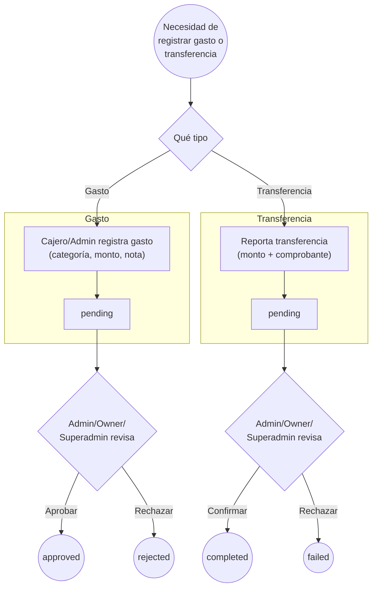

# Proceso — Rendiciones (Gastos y Transferencias)

> **Última actualización:** 2026-09-03 — MrCasuela
> (actualizar esta línea cada vez que se edite el documento)

> **⚠️ Nota de alcance — leer antes de seguir:** este proceso está **apagado a propósito en Backend V2** vía el flag `rendiciones: false` (`src/lib/v2Features.js`, comentario en el código: *"Gastos, transferencias y dashboard de rendiciones (aún no en V2)"*). A diferencia de Compras Semanales (`PROCESO_COMPRAS_SEMANALES.md`), acá **sí hay una guardia explícita**: con el flag apagado, las funciones de escritura (`postExpense`, `postTransfer`, `patchExpense`, `patchTransfer`) lanzan un error controlado antes de llamar a la red, y las de lectura devuelven listas vacías sin error. La UI también muestra un aviso claro ("Rendiciones aún no disponibles"). Verificado: `/expenses`, `/transfers` y `/dashboard/rendiciones` no existen tampoco en `Gestflow-Backend-V2/app/api/routes/` — el proceso completo, tal como se describe acá, solo corrió (y solo funciona) contra el backend **legacy `Gestflow-backend`**. Se documenta para cuando/si se porte a V2.

---

## 1. Descripción del proceso

### 1.1 Objetivo

Registrar gastos operativos de un local (agua, luz, insumos, etc.) y transferencias de dinero entre el local y el negocio, con aprobación de un administrador antes de considerarlos válidos.

### 1.2 Actores

| Actor | Rol |
|---|---|
| **Cajero / Admin** | Registra un gasto o reporta una transferencia. |
| **Admin / Owner / Superadmin** | Aprueba o rechaza gastos y transferencias — segregación de funciones real: quien crea no siempre puede aprobar. |

### 1.3 Precondiciones

- Feature flag `rendiciones` activo (hoy `false` en V2).
- Backend con soporte para `/expenses` y `/transfers` (hoy solo el legacy).

### 1.4 Resultado esperado

Un gasto o transferencia en estado `approved`/`completed`, reflejado en el dashboard de rendiciones del local.

### 1.5 Alcance y fuera de alcance

Dentro: ciclo de vida de un gasto y de una transferencia tal como está construido en el código. Fuera: pagos automáticos, integración contable.

---

## 2. Diagrama BPMN (Mermaid)

Dos sub-flujos con la misma forma: crear → queda pendiente → un rol distinto decide.

---

## 3. Detalle de actividades

| Actividad | Qué hace el usuario/sistema | Componente técnico | API / Evento | Datos principales |
|---|---|---|---|---|
| Registrar gasto | Completa categoría (agua/luz/gas/internet/insumos/mantenimiento/personal/otro), monto y nota | `NuevoGastoModal` (`AdministrativeModule.jsx`) | `POST /expenses` | `local_id`, `category`, `amount`, `note`, `status='pending'` |
| Reportar transferencia | Completa monto y sube un comprobante | `ReportarTransferenciaModal` | `POST /transfers` (comprobante vía `uploadReceipt`) | `local_id`, `amount`, `receipt_url`, `status='pending'` |
| Aprobar/rechazar gasto | Un rol Admin+ decide sobre un gasto pendiente | botones Aprobar/Rechazar en la pestaña Rendiciones | `PATCH /expenses/{id}` | `status='approved'\|'rejected'` |
| Confirmar/rechazar transferencia | Un rol Admin+ decide sobre una transferencia pendiente | botones Confirmar/Rechazar | `PATCH /transfers/{id}` | `status='completed'\|'failed'` |
| Ver dashboard de rendiciones | Resumen de gastos/transferencias del local por período | `RendicionesContent` | `GET /dashboard/rendiciones` | totales, movimientos |

---

## 4. Errores y excepciones

| Error | Causa | Qué ve el usuario | Cómo responde el sistema |
|---|---|---|---|
| Flag apagado (situación actual) | `isV2FeatureEnabled('rendiciones') === false` | Banner ámbar: "Rendiciones aún no disponibles" | Lecturas devuelven vacío sin error; cualquier intento de escritura lanza `Error('Rendiciones aún no están disponibles en Backend V2')` **antes** de llamar a la red |
| Rol no autorizado a crear | En el backend legacy, crear un gasto requiere rol Cajero o superior | Error de permiso | 403 "Only admins and cashiers can create expenses" |
| Rol no autorizado a aprobar | Aprobar/rechazar requiere rol Admin o superior | Botones no visibles / error de permiso | 403 "Only admins can update expenses" (equivalente para transferencias) |

---

## 5. Trazabilidad: Actividad BPMN → Componente técnico → API/Evento → Datos

| Actividad BPMN | Componente técnico | API / Evento | Datos involucrados |
|---|---|---|---|
| Registrar gasto | `NuevoGastoModal` → `postExpense` | `POST /expenses` | `category`, `amount`, `note` |
| Registrar transferencia | `ReportarTransferenciaModal` → `postTransfer` | `POST /transfers` | `amount`, `receipt_url` |
| Aprobar/rechazar gasto | botones en `RendicionesContent` → `patchExpense` | `PATCH /expenses/{id}` | `status` |
| Confirmar/rechazar transferencia | botones en `RendicionesContent` → `patchTransfer` | `PATCH /transfers/{id}` | `status` |
| Dashboard de rendiciones | `getRendicionesDashboard` | `GET /dashboard/rendiciones` | totales por período |

---

## 6. Brechas funcionales conocidas

- [ ] **6.1 — Inactivo en Backend V2, sin fecha.** No hay endpoints `/expenses`, `/transfers` ni `/dashboard/rendiciones` en `Gestflow-Backend-V2` — el proceso completo (UI incluida, ya construida) está apagado por flag esperando la migración del backend. A diferencia de Compras Semanales, acá el apagado es deliberado y sin errores de red silenciosos.

---

## 7. Referencias de archivo

- `src/components/AdministrativeModule.jsx` — pestaña "Rendiciones" (`RendicionesContent`, modales de gasto/transferencia).
- `src/lib/administrativeApi.js` — `getRendicionesDashboard`, `getExpensesByLocal`, `getTransfersByLocal`, `postExpense`, `postTransfer`, `patchExpense`, `patchTransfer`.
- `src/lib/v2Features.js` — flag `rendiciones`.
- Backend (**legacy** `Gestflow-backend`, no Backend V2): `src/api/routes/expenses.py`, `src/api/routes/transfers.py`.
