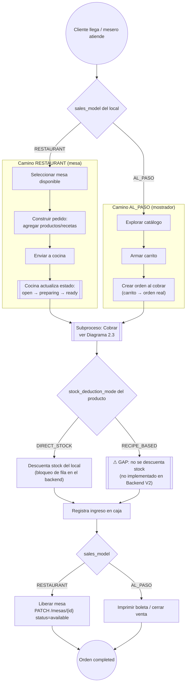
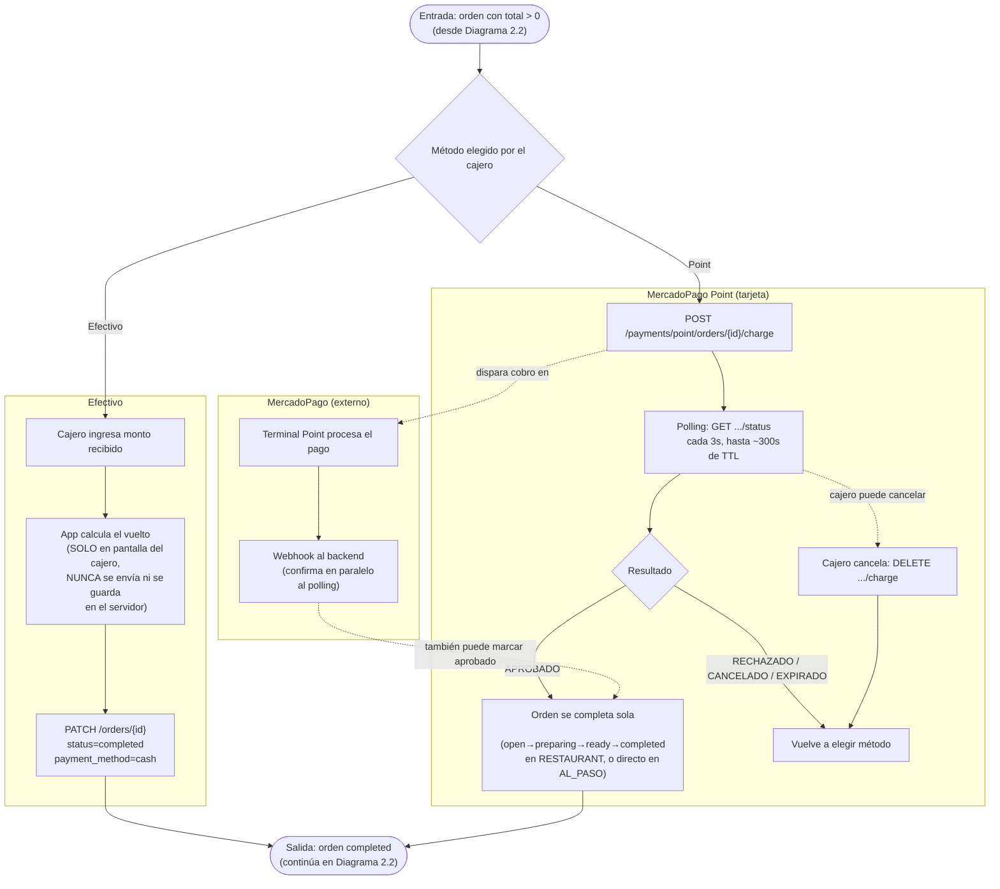

# Proceso de Venta — Sistema Web (GestFlow POS)

> **Última actualización:** 2026-09-03 — MrCasuela
> (actualizar esta línea cada vez que se edite el documento)

> **Nota de alcance:** este documento describe el proceso de venta tal como lo implementa el **sistema web** (`Gestflow-Frontend`), que soporta ambos modelos de venta: mesas (`RESTAURANT`) y mostrador (`AL_PASO`). El backend detrás de este flujo es **Gestflow-Backend-V2** (FastAPI) — el repo legacy `Gestflow-backend` no está en uso. Existe una versión equivalente de este documento en `Gestflow-Backend-V2/docs/PROCESO_VENTA.md` (versión completa, incluye también la app móvil) y en `GestFLow_APPMovil/docs/PROCESO_VENTA.md` (recortada a lo que esa app implementa — solo mostrador, sin mesas).
>
> Las referencias `archivo:línea` sin prefijo corresponden a este repo (`Gestflow-Frontend`); se marca `[Backend]` lo que corresponde a `Gestflow-Backend-V2`.

---

## 1. Descripción del proceso

### 1.1 Objetivo

Permitir que un cajero o mesero registre la venta de productos a un cliente desde el POS web (mesas o mostrador), cobre esa venta (en efectivo o con tarjeta vía MercadoPago Point) y deje el inventario y la caja del local actualizados.

### 1.2 Actores

| Actor | Rol |
|---|---|
| **Cajero / Mesero** | Persona que opera el POS web, arma el pedido y cobra. |
| **Cliente** | Recibe el producto y paga (en efectivo o con tarjeta). No interactúa directamente con el sistema. |
| **Sistema Web** | Este frontend (`Gestflow-Frontend`) — POS de mesas y de mostrador. |
| **Backend V2** | API FastAPI (`Gestflow-Backend-V2`) — dueño de la lógica de negocio, estados de la orden, stock y caja. |
| **MercadoPago** | Pasarela de pago externa — terminal Point físico + webhook de confirmación. |

### 1.3 Precondiciones

- El local tiene definido su `sales_model`: `RESTAURANT` (atiende con mesas) o `AL_PASO` (venta de mostrador).
- Existe una **caja abierta** para el local, y si el cajero tiene rol `EMPLEADO`, la caja debe ser la suya.
- Los productos a vender están activos y habilitados para ese local.
- Si se va a cobrar con MercadoPago Point, el local tiene un dispositivo/terminal vinculado y con conexión OAuth vigente.

### 1.4 Resultado esperado

- La orden queda en estado `completed`.
- Se registra un ingreso en caja por el total de la orden.
- Si el producto vendido descuenta stock directo, el inventario del local se reduce en la cantidad vendida.
- Si el local es `RESTAURANT`, la mesa asociada queda liberada.
- El cliente recibe su producto; el cajero puede imprimir boleta/comprobante.

### 1.5 Alcance y fuera de alcance

**Dentro de alcance:** creación y cobro de una orden de venta desde el sistema web, ambos caminos (`RESTAURANT` y `AL_PASO`), ambos métodos de pago (efectivo y MercadoPago Point), descuento de stock, liberación de mesa, errores esperables de cada paso.

**Fuera de alcance:** la app móvil (tiene su propia copia de este documento), el backend legacy `Gestflow-backend`, promociones/descuentos, apertura/cierre de caja como proceso independiente, gestión de recetas/inventario fuera del momento de venta, onboarding de locales/dispositivos MercadoPago.

---

## 2. Diagrama BPMN (Mermaid)

### 2.1 Cómo leer los diagramas

- `((...))` → **círculo**: evento de inicio/fin.
- `[...]` → **rectángulo**: actividad simple (una acción de una persona o un paso del sistema).
- `[[...]]` → **rectángulo de doble borde**: subproceso (tiene su propio detalle, sea en otro diagrama o en §3).
- `{...}` → **rombo**: gateway de decisión (compuerta exclusiva — el flujo toma una sola rama).
- `/.../` → **paralelogramo**: dato/entrada (no usado en los diagramas actuales; convención estándar de Mermaid si se agrega un nodo de este tipo a futuro).
- Los recuadros punteados (`-.->`) representan relaciones que ocurren "por fuera" del camino principal (ej. un webhook que llega en paralelo).
- Los `subgraph` agrupan actividades por actor/sistema, simulando los carriles (swimlanes) de un BPMN clásico — Mermaid no soporta swimlanes nativos.

### 2.2 Vista general

Gateway inicial según el `sales_model` del local. Ambos caminos convergen en el subproceso de cobro (ver §2.3), luego en el descuento de stock, y terminan liberando la mesa (solo `RESTAURANT`) o cerrando la venta (`AL_PASO`).

### 2.3 Zoom — subproceso de cobro

Ambos caminos del diagrama anterior desembocan aquí. El cajero elige método de pago; efectivo se resuelve en un solo paso, MercadoPago Point involucra un ida-y-vuelta con la terminal física y una confirmación asíncrona (webhook) que corre en paralelo al sondeo (polling) del frontend.

**Sobre la carrera webhook-vs-polling:** el webhook de MercadoPago (procesado en el backend) y el polling de este frontend son dos caminos independientes que intentan confirmar el mismo pago. El que llegue primero marca la orden como `completed`; el que llega después no tiene efecto. Esto es intencional: si el webhook se demora o falla, el polling igual completa la orden; si el polling se corta (el cajero cierra la pestaña), el webhook la completa igual en segundo plano.

---

## 3. Detalle de actividades

### 3.1 Camino RESTAURANT (mesa)

| Actividad | Qué hace el usuario/sistema | Componente técnico | API / Evento | Datos principales |
|---|---|---|---|---|
| Seleccionar mesa | El mesero ve las mesas del local y elige una disponible | `MesaWorkspace.jsx` | `GET /mesas?local_id=`, `GET /mesas/{id}` | `mesas.id`, `nombre`, `status` |
| Construir pedido | El mesero agrega productos (y variantes de receta, si aplica) al pedido de la mesa, uno por uno | `handleAgregarAlPedido` en `MesaWorkspace.jsx`; `[Backend]` `OrderService.add_item` | `POST /orders` (primera vez), `POST /orders/{id}/items` (siguientes) | `orders.local_id/caja_id/mesa_id/source`, `order_items.product_id/quantity`. El **precio siempre lo calcula el servidor** desde el catálogo — nunca se confía en el precio que manda el cliente. |
| Enviar a cocina | El pedido pasa de `open` a `preparing`, y de ahí a `ready` cuando está listo | `[Backend]` transiciones de estado del backend | `PATCH /orders/{id}` | `orders.status` |

### 3.2 Camino AL_PASO (mostrador)

| Actividad | Qué hace el usuario/sistema | Componente técnico | API / Evento | Datos principales |
|---|---|---|---|---|
| Explorar catálogo | El cajero ve los productos disponibles del local, con su stock | catálogo de mostrador | `GET /products`, `GET /local-products`, `GET /categories` | `products`, `local_products.is_active/price`, stock del local |
| Armar carrito | El cajero suma/resta cantidades de cada producto (carrito 100% local, sin llamadas al backend) | estado local del carrito | — | cantidades por producto, en memoria |
| Crear orden (al cobrar) | Al presionar "Cobrar", el carrito completo se convierte en una orden real de una sola vez — a diferencia de RESTAURANT, aquí la orden no existe hasta este momento | `handleCobrar` en `VentaDirectaView.jsx`; `[Backend]` `OrderService.create` + `add_item` | `POST /orders` (`source='mostrador'`, `mesa_id=null`), `POST /orders/{id}/items` por cada línea del carrito | `orders.local_id/caja_id/source`, `order_items.product_id/quantity` |

### 3.3 Subproceso de cobro (compartido por ambos caminos)

| Actividad | Qué hace el usuario/sistema | Componente técnico | API / Evento | Datos principales |
|---|---|---|---|---|
| Abrir cobro | Con la orden ya creada, se abre la pantalla de cobro | `MercadoPagoModal.jsx` | — | `order.total`, `order.id` |
| Cobro en efectivo | El cajero ingresa el monto recibido; la app calcula y muestra el vuelto | `handleConfirmCash` en `MercadoPagoModal.jsx` → `completeOrderCash` en `salesApi.js` | `PATCH /orders/{id}` con `status=completed`, `payment_method=cash` | `orders.payment_method='cash'`. El monto recibido y el vuelto **no se envían al servidor** (ver §6.1). |
| Cobro con Point — enviar cobro | El sistema envía el monto a la terminal física | `handleSendToTerminal`; `[Backend]` `create_point_charge` | `POST /payments/point/orders/{id}/charge` | `amount`, `terminal_id`, `orders.payment_method='MERCADOPAGO_POINT'` |
| Cobro con Point — esperar confirmación | La pantalla muestra "esperando al cliente" y consulta el estado cada 3 segundos | `startPolling`; `[Backend]` `get_point_order_status` | `GET /payments/point/orders/{id}/status`, cada 3s hasta ~300s de TTL | estado del cobro (pendiente/aprobado/rechazado/cancelado/expirado) |
| Cobro con Point — confirmación asíncrona | MercadoPago notifica el resultado del pago de forma independiente al polling | `[Backend]` webhook | `POST /payments/point/webhook` (en el backend) | `payment_id` de MercadoPago |
| Cobro con Point — cancelar | El cajero cancela un cobro que quedó pendiente (cliente se arrepintió, terminal no responde, etc.) | `handleCancelPoint`; `[Backend]` `cancel_point_charge` | `DELETE /payments/point/orders/{id}/charge` | estado del cobro pasa a cancelado |

### 3.4 Descuento de stock (compartido, automático — ocurre en el backend)

| Actividad | Qué hace el usuario/sistema | Componente técnico | API / Evento | Datos principales |
|---|---|---|---|---|
| Descontar stock directo | Al completarse la orden, se descuenta automáticamente el stock de los productos con descuento directo | `[Backend]` `OrderService._deduct_stock_for_order` | Disparado internamente por el mismo `PATCH /orders/{id}` que completa la orden | stock del local, con bloqueo de fila para evitar carreras entre dos ventas simultáneas del mismo producto |
| (No aplica) descuento por receta | Para productos armados por receta, hoy **no se descuenta nada** — ver §6.2 | `[Backend]` mismo método, rama que omite el producto | — | sin efecto en el inventario |
| Registrar ingreso en caja | Se registra el monto cobrado como ingreso de la caja | `[Backend]` mismo `PATCH /orders/{id}` | efecto colateral | monto, método de pago |
| Liberar mesa (solo RESTAURANT) | La mesa vuelve a estar disponible para el siguiente cliente | `handlePaymentSuccess` → libera la mesa | `PATCH /mesas/{id}` con `status=available` | `mesas.status` |

---

## 4. Errores y excepciones

| Error | Causa | Qué ve el usuario | Cómo responde el sistema |
|---|---|---|---|
| Transición de estado inválida | Se intenta pasar la orden a un estado que no está permitido desde el estado actual (ej. saltar directo a `completed` en una mesa sin pasar por `preparing`/`ready`) | Mensaje de error genérico en la pantalla de cobro | Este frontend detecta el patrón de "transición inválida" y reintenta recorriendo los estados intermedios automáticamente antes de reportar error al usuario |
| Stock insuficiente | El producto no tiene suficiente stock disponible al momento de completar la orden | Mensaje con el nombre del producto, cuánto había disponible y cuánto se pidió | La orden **no** queda completada; el backend valida el stock con bloqueo de fila |
| Orden no encontrada | Se referencia una orden que no existe o ya no es visible para el usuario actual | La orden no aparece / error genérico | El backend responde 404 |
| Caja cerrada o ajena | No hay caja abierta en el local, o un cajero con rol `EMPLEADO` intenta usar una caja que no es la suya | "No hay caja abierta en este local. Abre una caja antes de vender." (u error de permiso) | Se rechaza la operación antes de crear/cobrar la orden |
| Agregar ítem a orden cerrada | Se intenta sumar un producto a una orden ya completada o cancelada | No debería ocurrir desde la UI normal (los botones de agregar se deshabilitan) | El backend rechaza la operación |
| Monto insuficiente en efectivo | El monto ingresado por el cajero es menor al total de la orden | "El monto recibido debe ser al menos $X" | Se bloquea antes de llamar al backend — no se genera ninguna solicitud |
| Pago con Point rechazado | La terminal informa que el pago fue rechazado | "Pago rechazado por la terminal. Podés intentar de nuevo." | Vuelve a la pantalla de selección de método de pago |
| Cobro Point expirado (TTL) | Pasaron ~300 segundos sin confirmación de pago | "No detectamos el pago en la terminal. Verificá que cobraste exactamente $X y volvé a enviar el cobro." | Deja de sondear (polling) y vuelve a selección de método |
| Cobro Point cancelado durante la espera | El cajero cancela manualmente un cobro pendiente | Vuelve a la pantalla de selección, sin mensaje de error | Best-effort: si MercadoPago ya no permite cancelar en su lado, el backend igual lo marca cancelado localmente; se recomienda al cajero confirmar también en el equipo físico |
| Orden cancelada durante el cobro | La orden fue cancelada (por otro usuario u otro proceso) mientras se esperaba el pago | "La orden fue cancelada durante el cobro." | Deja de sondear (polling) |

---

## 5. Trazabilidad: Actividad BPMN → Componente técnico → API/Evento → Datos

| Actividad BPMN | Componente técnico | API / Evento | Datos involucrados |
|---|---|---|---|
| Determinar `sales_model` del local (gateway inicial) | redirección según tipo de local | resuelto al crear la orden | `locals.sales_model` (`RESTAURANT` \| `AL_PASO`) |
| Seleccionar mesa | `MesaWorkspace.jsx` | `GET /mesas`, `GET /mesas/{id}` | `mesas.id`, `nombre`, `status` |
| Construir pedido — RESTAURANT | `handleAgregarAlPedido` | `POST /orders`, `POST /orders/{id}/items` | `orders.*`, `order_items.product_id/quantity/unit_price` |
| Enviar a cocina / avanzar estado | `[Backend]` transiciones de estado | `PATCH /orders/{id}` | `orders.status` (`open`→`preparing`→`ready`) |
| Crear orden — AL_PASO (carrito → orden de una vez, al cobrar) | `handleCobrar` en `VentaDirectaView.jsx` | `POST /orders` (`source='mostrador'`), `POST /orders/{id}/items` | `orders.*`, `order_items.product_id/quantity` |
| Abrir cobro | `MercadoPagoModal.jsx` | — | `order.total`, `order.id` |
| Cobro en efectivo | `handleConfirmCash` → `completeOrderCash` | `PATCH /orders/{id}` `status=completed&payment_method=cash` | monto recibido (solo cliente, no se envía) |
| Cobro Point — enviar a terminal | `handleSendToTerminal` | `POST /payments/point/orders/{id}/charge` | monto, `terminal_id` |
| Cobro Point — sondeo de estado | `startPolling` (cada 3s) | `GET /payments/point/orders/{id}/status`, hasta TTL 300s | estado del cobro |
| Cobro Point — cancelar cobro pendiente | `handleCancelPoint` | `DELETE /payments/point/orders/{id}/charge` | estado del cobro pasa a cancelado |
| Descuento de stock (DIRECT_STOCK) | `[Backend]` | disparado por el `PATCH /orders/{id}` que completa la orden | stock del local |
| Registrar ingreso en caja | `[Backend]` | efecto colateral del `PATCH /orders/{id}` | monto, método de pago |
| Liberar mesa (solo RESTAURANT) | `handlePaymentSuccess` | `PATCH /mesas/{id}` `status=available` | `mesas.status` |

---

## 6. Brechas funcionales conocidas

- [ ] **6.1 — El vuelto en efectivo no se persiste en el servidor.** El monto recibido y el cambio calculado se muestran solo en la pantalla del cajero. El `PATCH` que completa la orden solo envía `status` y `payment_method='cash'` — el backend no guarda cuánto efectivo recibió el cajero ni cuánto vuelto dio. **Implicación:** hoy no hay forma de auditar montos de efectivo recibidos después del hecho.

- [ ] **6.2 — Los productos por receta (`RECIPE_BASED`) no descuentan stock al vender.** Solo se descuenta inventario para productos con descuento directo. El descuento a nivel de ingrediente no está implementado en Backend V2. **Implicación:** locales que venden productos armados por receta no ven moverse el inventario de sus insumos al completar esas ventas.

---

## 7. Referencias de archivo

**Este repo** (`Gestflow-Frontend`):
- `src/routes/AuthenticatedRoutes.jsx` — rutas del POS.
- `src/pages/.../MesaWorkspace.jsx` — flujo de mesa (agregar ítems, cobrar, cancelar).
- `src/pages/.../VentaDirectaView.jsx` — flujo de mostrador.
- `src/components/pos/MercadoPagoModal.jsx` — modal de cobro compartido (efectivo y Point).
- `src/lib/salesApi.js` — capa de adaptación hacia Backend V2.
- `src/lib/apiClient.js` — cliente HTTP base.

**Backend** (`Gestflow-Backend-V2`, repo separado — ver su `docs/PROCESO_VENTA.md` para el detalle completo del lado servidor):
- `app/services/orders.py` — transiciones de estado, cobro, descuento de stock.
- `app/api/routes/mp_point_charging.py` — cobro, sondeo, cancelación y webhook de MercadoPago Point.
